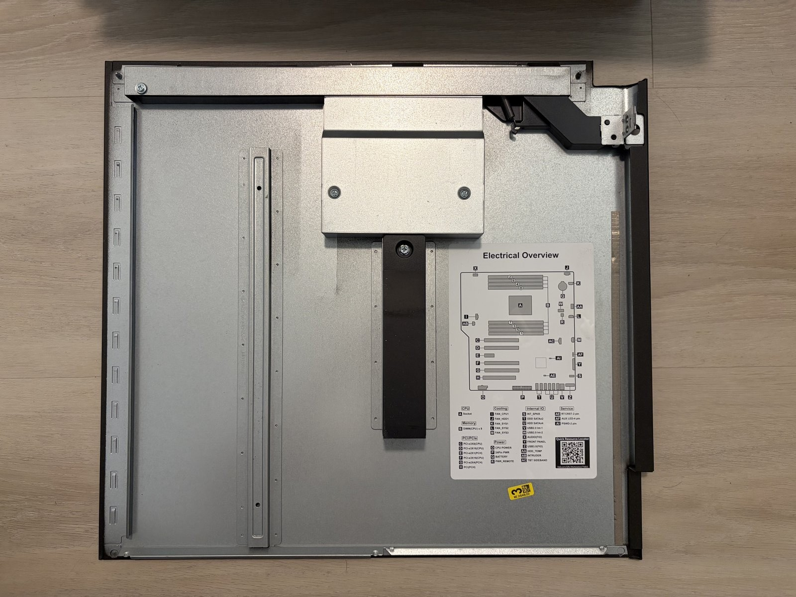
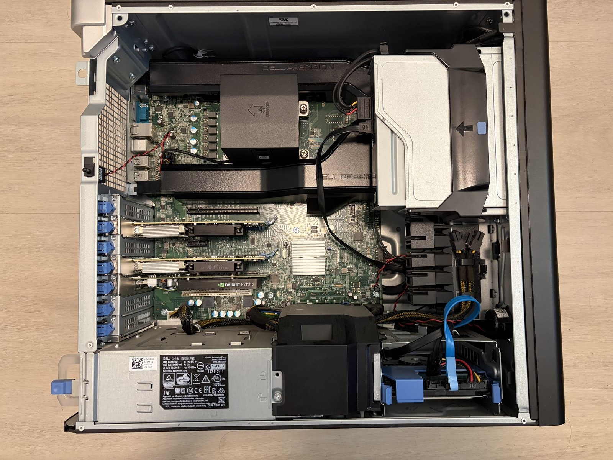
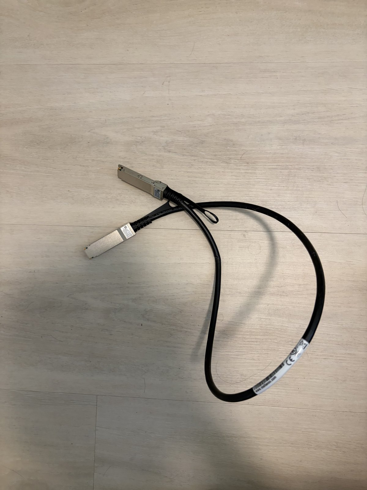

# RDMA-Based AI Communication Infrastructure

A from-scratch implementation of RDMA communication primitives, transport abstractions, and collective operations — targeting the infrastructure layer of distributed AI training and inference systems.

Built with `libibverbs` and `rdma_cm` (no wrappers, no frameworks), implementing two end-to-end workloads from raw verbs upward: a mini NCCL-style ring all-reduce and a vLLM-style remote KV cache (prefill via RDMA write, decode via RDMA read).

Tested on a real RDMA home lab: two ConnectX-4 NICs, RoCEv2, bare metal, connected back-to-back and isolated into separate network namespaces so each port behaves like an independent host.

## Phase Status

- [x] **Phase 1** — RDMA Verbs Foundation (RC QP, MR, CQ, send/recv, RDMA write, benchmarks). Uses `rdma_cm` for connection setup — some RDMA fabrics (e.g. iWARP) reject manual `ibv_modify_qp` state transitions, so this project standardizes on `rdma_cm` across all backends. Migration retrospective: [`docs/raw-verbs-evolution.md`](docs/raw-verbs-evolution.md).
- [x] **Phase 2** — Transport Abstraction Layer (RDMA + TCP backends via rdma_cm, send/recv + write benchmarks; TCP write omitted — no one-sided primitive)
- [x] **Phase 3** — Ring All-Reduce (chunked pipeline, ring reduce-scatter + all-gather, RDMA + TCP backends)
- [x] **Phase 4** — Remote KV Cache (slab allocator over single MR, ctrl/data plane separation, prefill via RDMA write, decode via RDMA read)
- [ ] **Phase 5** — Bare-metal RoCEv2 benchmark (in progress). Re-running the Phase 1–4 benchmarks on real ConnectX-4 hardware over RoCEv2.

## Hardware & Test Environment

### Hardware

| | |
|---|---|
|  | Chassis opened, bare motherboard — before installing RAM or NICs. |
|  | The side panel doubles as a wiring diagram — header/slot layout reference. |
|  | Two Mellanox ConnectX-4 100GbE NICs, still in anti-static trays. |
|  | Both ConnectX-4 cards seated in PCIe slots. |
|  | Same state, top-down angle. |
|  | QSFP28 DAC cable — connects the two ports back-to-back, no switch in the loop. |

### RoCEv2 Bring-Up + Network Namespace Isolation

Both ConnectX-4 ports are wired directly to each other. To make this single host behave like two independent hosts for testing (and avoid ARP flux / `rp_filter` drops that come from having two NICs on the same L2 segment in one namespace), each device is moved into its own network namespace.

`scripts/setup_netns.sh` automates the steps below and is safe to re-run:

```bash
sudo bash scripts/setup_netns.sh
```

Manual walkthrough:

```bash
# 1. Confirm physical link is up
rdma link
# link mlx5_0/1 state ACTIVE physical_state LINK_UP netdev ens2np0
# link mlx5_1/1 state ACTIVE physical_state LINK_UP netdev ens4np0

# 2. Confirm RoCEv2 GID (not just the auto-generated IPv6 link-local RoCEv1 entry)
for dev in mlx5_0 mlx5_1; do
  for f in /sys/class/infiniband/$dev/ports/1/gids/*; do
    gid=$(cat "$f")
    [ "$gid" != "0000:0000:0000:0000:0000:0000:0000:0000" ] && \
      echo "$dev idx=$(basename "$f") gid=$gid type=$(cat "${f/gids/gid_attrs\/types}")"
  done
done
# idx=1 ... type=RoCE v2   <- this is the GID index perftest's -x should use

# 3. Switch to netns-exclusive mode (one-way on some kernels — do this before anything binds the devices)
sudo rdma system set netns exclusive

# 4. Create two namespaces and hand one device to each
sudo ip netns add ns1
sudo ip netns add ns2
sudo rdma dev set mlx5_0 netns ns1
sudo rdma dev set mlx5_1 netns ns2

# 5. Verify isolation — each namespace should see exactly one device, root netns should see none
sudo ip netns exec ns1 rdma dev show   # 0: mlx5_0 ...
sudo ip netns exec ns2 rdma dev show   # 1: mlx5_1 ...
sudo rdma dev show                     # (empty)

# 6. Assign IPs and bring interfaces up inside each namespace
sudo ip netns exec ns1 ip addr add 192.168.100.1/24 dev ens2np0
sudo ip netns exec ns1 ip link set ens2np0 up
sudo ip netns exec ns1 ip link set lo up

sudo ip netns exec ns2 ip addr add 192.168.100.2/24 dev ens4np0
sudo ip netns exec ns2 ip link set ens4np0 up
sudo ip netns exec ns2 ip link set lo up
```

With this in place, `ns1` and `ns2` behave like two separate machines connected over RoCEv2 — benchmarks run with `sudo ip netns exec ns1 <binary> ...` / `sudo ip netns exec ns2 <binary> ... 192.168.100.1`.

## Architecture

```
rdma-ai-infra/
│
├── common/                          # linked by all phases
│   └── include/
│       ├── timing.h                 # CLOCK_MONOTONIC nanosecond timer
│       ├── logging.h                # LOG_INFO / LOG_ERR macros
│       └── bench_utils.h            # print_latency / print_bandwidth
│
├── phase1_verbs/                    # Pure C ────────────────────────────
│   ├── include/
│   │   └── rdma_common.h            # rai_qp_t, rai_mr_t, rai_conn_info_t
│   ├── src/
│   │   ├── rdma_qp.c                # rai_qp_destroy (idempotent teardown)
│   │   ├── rdma_mr.c                # MR register / deregister
│   │   ├── rdma_ops.c               # post_send / post_recv / post_write / post_read / poll_cq
│   │   ├── rdma_cm_connect.c        # rdma_cm-based connect (listen/accept/connect)
│   │   ├── rdma_verbs_connect.c     # raw verbs connect (manual INIT→RTR→RTS, RoCE v2)
│   │   └── rdma_oob_connect.c       # rai_oob_listen / accept / connect (TCP side-channel)
│   └── bench/
│       ├── lat_send_recv.c          # two-sided ping-pong latency
│       ├── lat_rdma_write.c         # one-sided write latency
│       └── bw_rdma_write.c          # throughput (sliding window + unsignaled WRs)
│                                    # ── C / C++ boundary ────────────────
│
├── phase2_transport/                # C++17
│   ├── include/
│   │   ├── transport.hpp            # Transport pure virtual base class + ScopedBuffer
│   │   ├── rdma_backend.hpp
│   │   └── tcp_backend.hpp
│   ├── src/
│   │   ├── rdma_backend.cpp         # wraps phase1 via extern "C"
│   │   └── tcp_backend.cpp
│   └── bench/
│       └── backend_compare.cpp      # send/recv on RDMA + TCP, write on RDMA only
│
├── phase3_collective/               # C++17
│   ├── include/
│   │   └── collective.hpp           # World struct, world_init, ring_allreduce
│   ├── src/
│   │   ├── world.cpp                # process group init, parallel listen/connect
│   │   └── ring_allreduce.cpp       # chunked ring all-reduce (float32 sum)
│   └── bench/
│       └── allreduce_bench.cpp      # correctness check + latency benchmark
│
├── phase4_kv_cache/                 # C++17
│   ├── include/
│   │   └── kv_cache.hpp             # KVPool (slab allocator), KVRemote, KVMeta, CtrlBuf
│   ├── src/
│   │   └── kv_server.cpp            # ctrl (TCP) + data (RDMA) server, ALLOC/FREE protocol
│   └── bench/
│       └── kv_bench.cpp             # prefill (RDMA write) + decode (RDMA read) benchmark
│
├── python_bindings/                 # pybind11, opt-in (-DBUILD_PYBIND=ON, default ON)
│   ├── bindings/
│   │   └── transport_py.cpp         # wraps Phase 2's Transport (send/recv/read/write/poll)
│   ├── python/rai_rdma/
│   │   └── __init__.py              # register() — torch.Tensor-aware buffer registration
│   └── examples/                    # echo client/server, torch.Tensor transport demos
│
├── scripts/
│   ├── setup.sh                     # apt install + SoftRoCE setup + build
│   └── setup_netns.sh               # idempotent ns1/ns2 RDMA isolation (see Hardware & Test Environment)
│
├── CMakeLists.txt
└── README.md
```

## Build

**Quick start** (auto-detects hardware RDMA / falls back to SoftRoCE, installs deps, builds):

```bash
bash scripts/setup.sh
```

**Manual** (Ubuntu 22.04):

```bash
sudo apt install build-essential cmake libibverbs-dev librdmacm-dev ibverbs-utils rdma-core

# Optional: SoftRoCE for development (not needed if real RDMA hardware is present)
sudo apt install linux-modules-extra-$(uname -r)
sudo modprobe rdma_rxe
sudo rdma link add rxe0 type rxe netdev eth0

# Build (defaults to RelWithDebInfo; pass -DCMAKE_BUILD_TYPE=Debug for gdb work)
cmake -B build && cmake --build build -j
```

## Running Benchmarks

All benchmarks are server/client pairs. On the netns-isolated home lab setup, the server runs in `ns1` and the client in `ns2`, pointed at `ns1`'s IP (`192.168.100.1`) — see [RoCEv2 Bring-Up + Network Namespace Isolation](#rocev2-bring-up--network-namespace-isolation) above. Running a benchmark outside its namespace, or pointed at `127.0.0.1`, fails with `RDMA_CM_EVENT_CONNECT_ERROR` (no RDMA device on `lo`, and the root netns has neither NIC once they're assigned to `ns1`/`ns2`). Default port is 12345 unless noted.

### Phase 1 — raw RDMA primitives

```bash
cd build/phase1_verbs

# Send/recv RTT
sudo ip netns exec ns1 ./lat_send_recv                           # server
sudo ip netns exec ns2 ./lat_send_recv 192.168.100.1              # client

# RDMA write latency (one-sided)
sudo ip netns exec ns1 ./lat_rdma_write
sudo ip netns exec ns2 ./lat_rdma_write 192.168.100.1

# RDMA write throughput (server and client must use the same --size)
sudo ip netns exec ns1 ./bw_rdma_write --size 65536
sudo ip netns exec ns2 ./bw_rdma_write 192.168.100.1 --size 65536 --iters 1000 --depth 16
```

**Connection setup mode.** Every Phase 1 benchmark takes `--conn cm|verbs`
(default `cm`), selecting how the QP is brought up — `librdmacm`, or raw verbs
walking INIT → RTR → RTS by hand. Both sides must agree. The data path is the
same code either way, so a matched pair of runs isolates the cost of connection
setup itself:

```bash
sudo ip netns exec ns1 ./lat_send_recv --conn verbs
sudo ip netns exec ns2 ./lat_send_recv 192.168.100.1 --conn verbs
```

The raw verbs path is RoCE v2 only, picks its GID index by scanning the port's
GID table, and auto-selects the single RDMA device visible in its namespace
(override with `RDMA_DEVICE=<dev>`).

### Phase 2 — Transport abstraction (RDMA vs TCP)

```bash
cd build/phase2_transport

sudo ip netns exec ns1 ./backend_compare rdma                    # server
sudo ip netns exec ns2 ./backend_compare rdma 192.168.100.1       # client (TCP: replace `rdma` with `tcp`)

# Use --port / --iters / --size for non-defaults; port is *not* positional.
sudo ip netns exec ns1 ./backend_compare rdma --port 23456
```

### Phase 3 — ring all-reduce (multi-process collective)

```bash
cd build/phase3_collective

# Both ranks need to start within ~60s of each other (connect retries every 100ms for 60s).
# Args: <rank> <world_size> <base_port> <host_0> <host_1> [...] [--rdma] [--count N] [--iters N]

# rank 0 (in ns1):
sudo ip netns exec ns1 ./allreduce_bench 0 2 12345 192.168.100.1 192.168.100.2 --rdma

# rank 1 (in ns2):
sudo ip netns exec ns2 ./allreduce_bench 1 2 12345 192.168.100.1 192.168.100.2 --rdma
```

### Phase 4 — Remote KV cache

```bash
cd build/phase4_kv_cache

# Server (in ns1): kv_server <port> <num_slots> <slot_size>
sudo ip netns exec ns1 ./kv_server 12345 16 4096

# Client (in ns2, kv_bench wires up ctrl-on-port + data-on-port+2 internally):
sudo ip netns exec ns2 ./kv_bench 192.168.100.1 12345 [--iters <n>]
```

## Benchmark Results

_Pending — numbers go here as they're collected._

## Toolchain

- **OS**: Ubuntu 22.04 LTS
- **Compiler**: GCC 7+, `-std=c11` (Phase 1), `-std=c++17` (Phase 2+)
