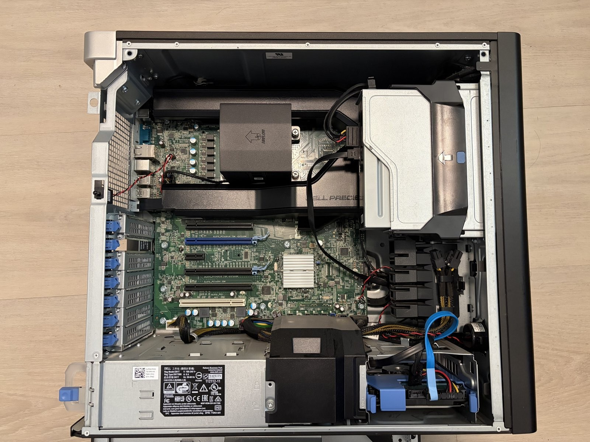
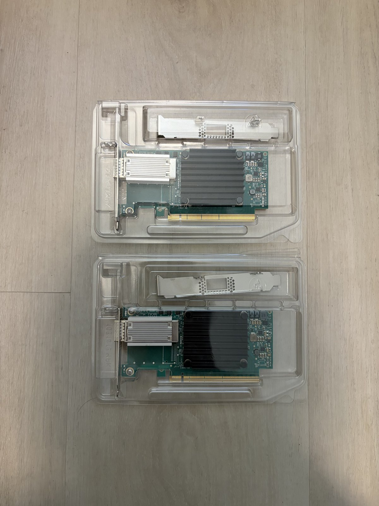
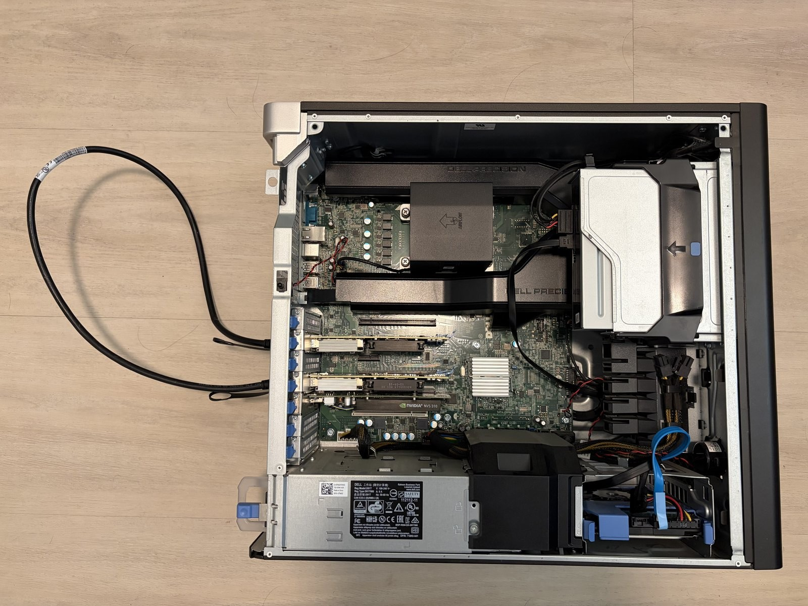
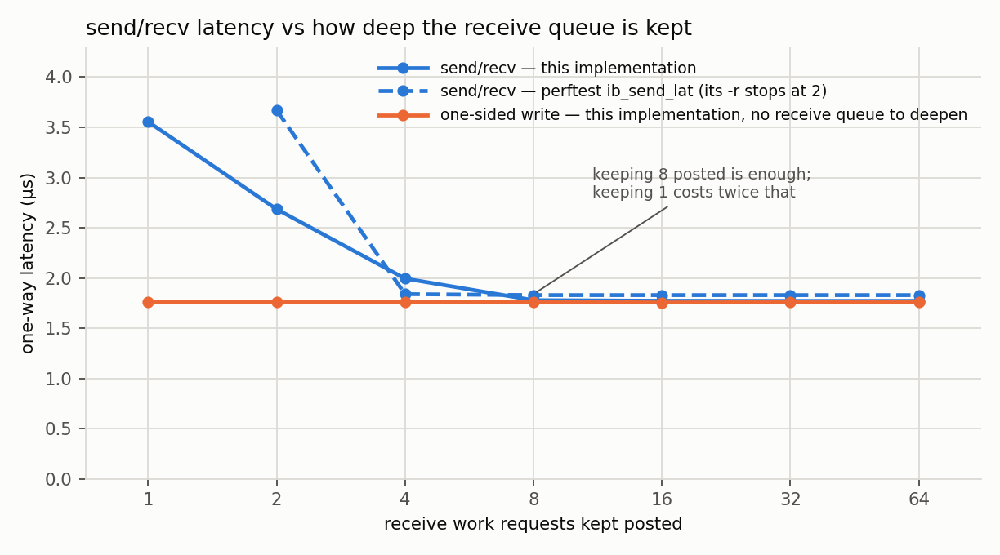
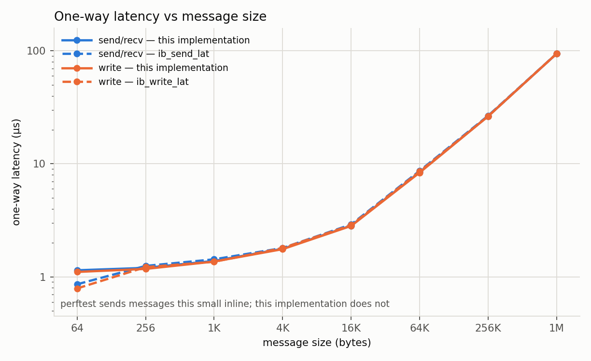
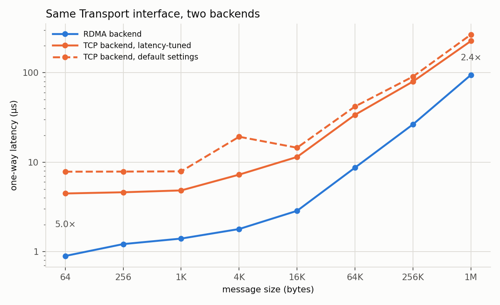
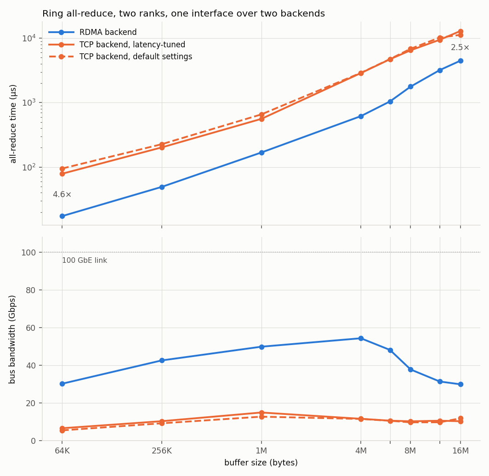

# RDMA-Based AI Communication Infrastructure

A from-scratch implementation of RDMA communication primitives, transport abstractions, and collective operations — targeting the infrastructure layer of distributed AI training and inference systems.

Built with `libibverbs` and `rdma_cm` (no wrappers, no frameworks). On top of
the verbs layer sit two end-to-end workloads: a ring all-reduce (chunked
reduce-scatter then all-gather, the algorithm NCCL uses), and a remote memory
pool that clients fill by RDMA write and read back one-sidedly — the transfer
path a disaggregated KV cache runs on.

Tested on a real RDMA home lab — two ConnectX-4 NICs, RoCEv2, bare metal,
back-to-back, each port in its own network namespace so it behaves as an
independent host — and measured against perftest: latency within 4% at every
message size, bandwidth within 2% wherever the link is the bottleneck.

## Phase Status

- [x] **Phase 1** — RDMA verbs foundation: RC queue pairs, memory regions,
  completion queues, send/recv, write, read, inline send. Connections come up
  either through librdmacm or through a hand-written INIT → RTR → RTS state
  machine, selectable at runtime; the data path is shared.
- [x] **Phase 2** — Transport Abstraction Layer (RDMA + TCP backends via rdma_cm, send/recv + write benchmarks; TCP write omitted — no one-sided primitive)
- [x] **Phase 3** — Ring All-Reduce (ring reduce-scatter + all-gather over the
  Phase 2 interface, RDMA + TCP backends). Receives are posted a step ahead on
  the RDMA path; without that a late receiver costs the sender an RNR backoff,
  which at 1 MB was the difference between 2.0 ms and 187 µs.
- [x] **Phase 4** — Remote slot pool (slab allocator over a single MR; alloc/free on a control channel, data by one-sided write and read, so the server's CPU is not in the data path)
- [ ] **Phase 5** — Bare-metal RoCEv2 benchmark (in progress). Re-running the Phase 1–4 benchmarks on real ConnectX-4 hardware over RoCEv2.

## Hardware & Test Environment

### Hardware

| | |
|---|---|
|  | Chassis opened, RAM in, PCIe slots still empty. |
|  | Two Mellanox ConnectX-4 100GbE NICs. |
|  | Both cards seated, wired to each other with a QSFP28 DAC — no switch in the loop. |

### Bring-up

The two ports are wired straight to each other. Each device then goes into its
own network namespace, so one host behaves like two independent peers — and so
two NICs on one L2 segment cannot confuse each other's ARP.

| | |
|---|---|
| NICs | 2× Mellanox ConnectX-4 (MT27700), 100GbE |
| Link | QSFP28 DAC, port to port, no switch |
| Path MTU | 1024 B, from the netdev's 1500 B Ethernet MTU |
| CPU | Xeon E5-1650 v4, 6C/12T, single NUMA node |
| OS | Ubuntu 22.04, kernel 5.15 |

Sweeps pin the CPU governor to `performance`, stop irqbalance, and put server
and client on different physical cores. **Both processes are on one machine**:
the RDMA path is real, but CPU, memory bandwidth and PCIe are shared in a way
two machines would not be.

Step-by-step, and what each step is guarding against:
[`docs/hardware-setup.md`](docs/hardware-setup.md).

## Architecture

```
common/            timing, logging, benchmark stats; the CLI and config the
                   Phase 1 benchmarks share
phase1_verbs/      C. RC queue pairs, memory regions, send/recv/write/read, poll.
                   Two ways to bring a connection up — librdmacm, or the
                   INIT→RTR→RTS state machine by hand — behind one call shape.
phase2_transport/  C++17. One Transport interface over RDMA and TCP backends.
phase3_collective/ C++17. Ring all-reduce: chunked reduce-scatter + all-gather.
phase4_kv_cache/   C++17. Slab allocator over one MR. Alloc/free control plane,
                   one-sided data plane; the server is a passive target.
python_bindings/   pybind11 wrapper around Transport. Registers any buffer-protocol
                   object (numpy, torch) for RDMA without copying it.
scripts/           bring-up, benchmark sweep, plotting.
```

## Build

```bash
bash scripts/setup.sh                      # dependencies, then build
cmake -B build && cmake --build build -j   # just the build, deps already in place
```

Defaults to `RelWithDebInfo`; pass `-DCMAKE_BUILD_TYPE=Debug` for gdb work.

## Namespace Setup

This has to be re-run after every reboot:

```bash
sudo bash scripts/setup_netns.sh     # idempotent
```

## Running Benchmarks

The whole sweep, against perftest at the same points, plus the figures:

```bash
sudo bash scripts/run_phase1_sweep.sh   # ~10 min -> results/phase1_sweep.csv
sudo bash scripts/run_phase2_sweep.sh   # ~6 min  -> results/phase2_sweep.csv
sudo bash scripts/run_phase3_sweep.sh   # ~13 min -> results/phase3_sweep.csv
python3 scripts/plot_phase1.py          # -> results/*.png
python3 scripts/plot_phase2.py
python3 scripts/plot_phase3.py
```

The phase 2 sweep changes system-wide settings while it runs — CPU governor,
irqbalance, NIC interrupt moderation, busy-poll sysctls — and puts them back
on exit.

One benchmark on its own — server in `ns1`, client in `ns2`:

```bash
sudo ip netns exec ns1 ./build/phase1_verbs/lat_send_recv
sudo ip netns exec ns2 ./build/phase1_verbs/lat_send_recv 192.168.100.1
```

Same shape for the others; `--help` lists the options. Both sides must agree on
`--size`, `--depth` and `--conn`.

`--conn` picks who sets the connection up: `cm` hands it to librdmacm, `verbs`
walks the queue pair through INIT → RTR → RTS in this code. After that both run
the same send and receive path.

## Benchmark Results

Phases 1 to 3. Phase 4 has not been re-run on this hardware yet — that is what
Phase 5 is.

Latency is one-way throughout: these benchmarks time a round trip and halve it,
which is what perftest does before printing.

### Phase 1 — verbs against perftest

Median of at least five runs per point, with the equivalent perftest tool run
at the same points on the same link.

- **Latency within 4% of perftest at every size**, bandwidth within 2%
  wherever the link is the bottleneck.
- **Receive queue depth decides how often a slow path gets hit** — one work
  request posted instead of eight costs 1.78 → 3.56 µs one-way. perftest moves
  the same way, 1.83 → 3.66: this is the hardware, not the implementation.
- **One-sided is not the faster one** — 8% at 64 B here, 9% for perftest, and
  nothing at all by 1 MB. What it buys is that the far side posts no work
  requests and reaps no completions: CPU, not µs.

### Receive queue depth



An arriving message needs a receive work queue entry before the NIC can place
it. With one posted the NIC often has to go fetch it while the packet is already
arriving; with eight it almost never does. Past eight the curve is flat.

Nothing gets slower — you just hit the slow case more often. At depth 8 the p99
is 3.60 µs — about what the median is at depth 1. One slow path, two
frequencies. It is also why depth 1 is the only point whose median wobbles from
run to run.

perftest's `-r` rounds odd values up, so its line starts at 2.

The one-sided line posts no receive work requests at all, so this knob cannot
reach it, and its flatness is what says the drop beside it is a real effect
rather than drift during the sweep.

### Latency and bandwidth against perftest



One-way latency in µs, with perftest's figure for the same operation in
parentheses:

| | 64 B | 4 KB | 64 KB | 1 MB |
|---|---|---|---|---|
| send/recv | 0.88 (0.86) | 1.77 (1.83) | 8.54 (8.70) | 94.5 (95.1) |
| write | 0.81 (0.79) | 1.76 (1.80) | 8.39 (8.59) | 94.6 (95.0) |

Messages of 220 B or less go inline: the payload rides inside the work request
itself, sparing the NIC a separate fetch of the buffer. Before that was added
the 64 B row read 1.14 and 1.11 — 33–40% behind.

Write bandwidth reaches 92.4 Gbps at 16 KB, 92.0 at 64 KB and 90.8 at 1 MB
(`ib_write_bw`: 92.5, 92.5, 92.6). Below 16 KB neither tool is link-bound and
the result turns on how each one pipelines; they are not configured
equivalently there, so that range is left out rather than claimed.

### Connection setup mode

librdmacm and the hand-written INIT → RTR → RTS path measure the same —
1.77 vs 1.77 µs send/recv, 92.03 vs 92.05 Gbps. Setup runs once, before the
timed loop, so it cannot show up in the numbers; identical numbers mean the
hand-written path got every QP parameter right.

### Phase 2 — the same interface over RDMA and TCP

Median of 15 runs per point. TCP is measured twice: once tuned for latency
(`TCP_NODELAY`, interrupt moderation turned down, busy polling so `recv()`
spins instead of sleeping) and once at stock settings. The gap is quoted against
whichever configuration measured better at that size, so the comparison never
leans on a badly configured TCP.



- **A C++ interface over the verbs layer costs under 2%** at every size — 0.90
  vs 0.88 µs at 64 B, 94.6 vs 94.5 at 1 MB against phase 1's bare verbs.
- **RDMA is 2.4–5.0× faster than the better TCP configuration.** The gap is
  widest for small messages, where fixed per-message cost dominates, and
  narrowest at 1 MB, where both are moving bytes.
- **It is also far steadier.** Run to run, RDMA's median moves 0.0% (IQR);
  TCP's moves 8–10%. Per message, **RDMA's p99 is below TCP's median at every
  size** — its bad case beats TCP's typical case.

| | 64 B | 4 KB | 64 KB | 1 MB |
|---|---|---|---|---|
| RDMA | 0.90 | 1.79 | 8.70 | 94.6 |
| TCP, tuned | 4.47 | 7.26 | 33.9 | 226 |
| TCP, stock | 7.83 | 19.3 | 42.0 | 267 |

Both TCP configurations pay for the interrupt path — a traced run makes 8022
wakeups where the polling one makes 3 — while RDMA takes no interrupt on the
data path at all. The stock line also varies about 2.4× at 4 KB and 16 KB; the
cause was not established, and no number above depends on that arm.

### Phase 3 — ring all-reduce over both backends

Median of 15 runs per point, two ranks, float32 sum. Same three arms and the
same conditions as phase 2. A world of two is the whole ring, so reduce-scatter
and all-gather are one step each.



- **RDMA finishes 2.5–4.7× sooner** than the better TCP configuration, and
  again it is the steadier one: run to run its median moves 0.8% against TCP's
  25–28%.
- **Bus bandwidth peaks at 54 Gbps of the 100 GbE link at 4 MB**, then falls to
  30 Gbps by 16 MB.
- **Over half the time at 16 MB is the summation, not the network.** Timing the
  two separately inside the collective puts the sum at 36% of the all-reduce at
  4 MB and 53% at 16 MB. Nothing overlaps them here — a rank sums only once both
  transfers of that step have completed, and the link is idle while it does.

| | 256 KB | 1 MB | 4 MB | 16 MB |
|---|---|---|---|---|
| RDMA, µs | 49.2 | 168.1 | 617.1 | 4480.1 |
| TCP tuned, µs | 201.8 | 559.6 | 2877.3 | 12944.8 |
| RDMA bus bw, Gbps | 42.6 | 49.9 | 54.4 | 30.0 |

Sampled only at 4 MB and 16 MB the bandwidth curve looks like a cliff, and the
obvious culprit is the summation's working set — equal to the buffer — crossing
this box's 15 MiB of L3. Filling in 6, 8 and 12 MB shows no cliff: the decline
starts at 4 MB and is gradual, and the transfer half slows down with it (84
Gbps of payload at 4 MB, 63 at 16 MB). Both halves lose ground as the buffers
leave cache; which mechanism does it was not isolated.

---

Several of these numbers were wrong first, including three separate occasions
where this implementation appeared to beat perftest and every one turned out to
be an error in the measurement. The trail is in
[`docs/benchmark-notes.md`](docs/benchmark-notes.md).

## Future Work

**Overlapping the summation with the transfer.** The sum is 36% of a 4 MB
all-reduce here and 53% of a 16 MB one, with the link idle throughout. NCCL
fuses receive, reduce and send into one primitive; this does them in sequence.
On these numbers it is the larger of the two things left on the table.

**Send/recv over one-sided writes.** NCCL's IB transport moves no data with
`IBV_WR_SEND` — the receiver writes a descriptor into the sender's memory and
the sender writes straight back into place, closing with `RDMA_WRITE_WITH_IMM`
(`ncclIbPostFifo`, `ncclIbIsend` in `src/transport/net_ib.cc`). A sender that
finds no descriptor returns instead of firing at an unarmed queue, so the RNR
stall Phase 3 had to work around cannot happen. Only `RdmaTransport` would
change; the collective above it would not.

## Toolchain

- **OS**: Ubuntu 22.04 LTS
- **Compiler**: GCC 11.4, `-std=c11` (Phase 1), `-std=c++17` (Phase 2+)
- **Build**: CMake 3.16+
