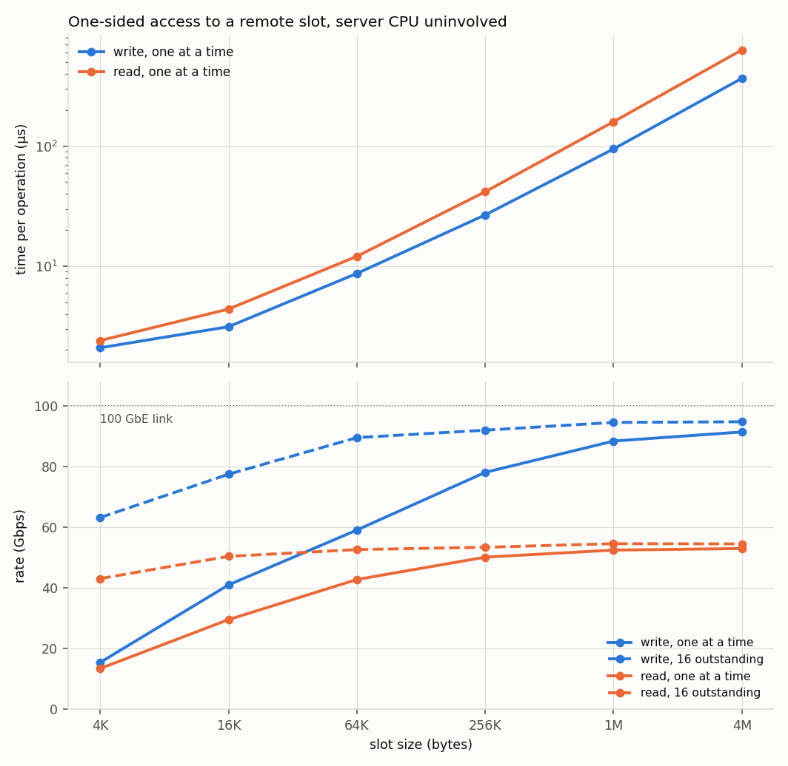

# RDMA-Based AI Communication Infrastructure

RDMA primitives, a transport layer over them, and two workloads that a
distributed training or inference system would actually run — written from
scratch on `libibverbs` and `rdma_cm`, no wrappers or frameworks.

The two workloads are a ring all-reduce (reduce-scatter then all-gather, one of
the shapes NCCL uses) and a remote memory pool that clients fill by RDMA write
and read back one-sidedly, which is the transfer path under a disaggregated KV
cache.

Everything runs on real hardware: two ConnectX-4 NICs cabled back to back over
RoCEv2, each port in its own network namespace so it behaves as a separate
host. Against perftest, latency is within 4% at every message size and
bandwidth within 2% wherever the link is the bottleneck.

## Phase Status

- [x] **Phase 1** — RDMA verbs foundation: RC queue pairs, memory regions,
  completion queues, send/recv, write, read, inline send. Connections come up
  either through librdmacm or through a hand-written INIT → RTR → RTS state
  machine, selectable at runtime; the data path is shared.
- [x] **Phase 2** — Transport Abstraction Layer (RDMA + TCP backends via rdma_cm, send/recv + write benchmarks; TCP write omitted — no one-sided primitive)
- [x] **Phase 3** — Ring All-Reduce (ring reduce-scatter + all-gather over the Phase 2 interface, RDMA + TCP backends)
- [x] **Phase 4** — Remote slot pool (slab allocator over a single MR; alloc/free on a control channel, data by one-sided write and read, so the server's CPU is not in the data path)
- [x] **Phase 5** — Bare-metal RoCEv2 benchmark. All four earlier phases re-run on real ConnectX-4 hardware over RoCEv2; the numbers below are from that hardware.

## Hardware & Test Environment

### Hardware

| | |
|---|---|
|  | Chassis opened, RAM in, PCIe slots still empty. |
|  | Two Mellanox ConnectX-4 100GbE NICs. |
|  | Both cards seated, wired to each other with a QSFP28 DAC — no switch in the loop. |

### Bring-up

The ports are cabled to each other, and each device goes into its own network
namespace. That makes one host behave as two peers, and keeps two NICs on the
same L2 segment from answering each other's ARP.

| | |
|---|---|
| NICs | 2× Mellanox ConnectX-4 (MT27700), 100GbE |
| Link | QSFP28 DAC, port to port, no switch |
| Path MTU | 1024 B, from the netdev's 1500 B Ethernet MTU |
| CPU | Xeon E5-1650 v4, 6C/12T, single NUMA node |
| OS | Ubuntu 22.04, kernel 5.15 |

Sweeps pin the governor to `performance`, stop irqbalance, and put the two
processes on different physical cores. **Both are on one machine**: the RDMA
path is real, but CPU, memory bandwidth and PCIe are shared in a way two
machines would not share them.

Step-by-step, and what each step is guarding against:
[`docs/hardware-setup.md`](docs/hardware-setup.md).

## Architecture

```
common/            timing, logging, benchmark stats; the CLI and config the
                   Phase 1 benchmarks share
phase1_verbs/      C. RC queue pairs, memory regions, send/recv/write/read, poll.
                   Two ways to bring a connection up — librdmacm, or the
                   INIT→RTR→RTS state machine by hand — behind one call shape.
phase2_transport/  C++17. One Transport interface over RDMA and TCP backends.
phase3_collective/ C++17. Ring all-reduce: chunked reduce-scatter + all-gather.
phase4_kv_cache/   C++17. Slab allocator over one MR. Alloc/free control plane,
                   one-sided data plane; the server is a passive target.
python_bindings/   pybind11 wrapper around Transport. Registers any buffer-protocol
                   object (numpy, torch) for RDMA without copying it.
scripts/           bring-up, benchmark sweep, plotting.
```

## Build

```bash
bash scripts/setup.sh                      # dependencies, then build
cmake -B build && cmake --build build -j   # just the build, deps already in place
```

Defaults to `RelWithDebInfo`; pass `-DCMAKE_BUILD_TYPE=Debug` for gdb work.

## Namespace Setup

This has to be re-run after every reboot:

```bash
sudo bash scripts/setup_netns.sh     # idempotent
```

## Running Benchmarks

The whole sweep, against perftest at the same points, plus the figures:

```bash
sudo bash scripts/run_phase1_sweep.sh   # ~10 min -> results/phase1_sweep.csv
sudo bash scripts/run_phase2_sweep.sh   # ~6 min  -> results/phase2_sweep.csv
sudo bash scripts/run_phase3_sweep.sh   # ~13 min -> results/phase3_sweep.csv
sudo bash scripts/run_phase4_sweep.sh   # ~3 min  -> results/phase4_sweep.csv
python3 scripts/plot_phase1.py          # -> results/*.png
python3 scripts/plot_phase2.py
python3 scripts/plot_phase3.py
python3 scripts/plot_phase4.py
```

All four pin the CPU governor and stop irqbalance while they run; phases 2 and
3 also set NIC interrupt moderation and the busy-poll sysctls, since those are
what their TCP arms are measured with and without. Every one of them puts the
settings back on exit.

One benchmark on its own — server in `ns1`, client in `ns2`:

```bash
sudo ip netns exec ns1 ./build/phase1_verbs/lat_send_recv
sudo ip netns exec ns2 ./build/phase1_verbs/lat_send_recv 192.168.100.1
```

Same shape for the others; `--help` lists the options. Both sides must agree on
`--size`, `--depth` and `--conn`.

## Benchmark Results

All four phases, re-run on this hardware — that is what Phase 5 is.

Phases 1 and 2 report one-way latency: those benchmarks time a round trip and
halve it, which is what perftest does before printing. Phases 3 and 4 report
what one operation took — a whole all-reduce, or one write or read against a
remote slot — and halve nothing.

### Phase 1 — verbs against perftest

Median of at least five runs per point, with the equivalent perftest tool run
at the same points on the same link.

- **Latency within 4% of perftest at every size**, bandwidth within 2%
  wherever the link is the bottleneck.
- **How many receives you keep posted decides how often a slow path gets hit**
  — eight posted gives 1.78 µs one-way, one gives 3.56. perftest moves the same
  way, 1.83 to 3.66, so this is the hardware and not the implementation.
- **One-sided buys almost no latency** — 8% at 64 B, and nothing at all by
  1 MB. perftest shows the same 9%. What it does buy is the far side's CPU:
  that side posts nothing and polls nothing.

#### Receive queue depth


The NIC needs a posted receive before it can place an arriving message. Keep
one posted and it often has to fetch one mid-arrival; keep eight and it almost
never does. Past eight the curve is flat.

Nothing gets slower as the queue shallows — the same slow path just comes up
more often. At depth 8 the p99 is 3.61 µs, roughly the median at depth 1, and
depth 1 is the only point that wobbles between runs. The one-sided line posts
no receives at all, so this knob cannot reach it. Its flatness is what makes
the drop beside it a real effect and not drift during the sweep.

#### Latency and bandwidth against perftest


One-way latency in µs, with perftest's figure for the same operation in
parentheses:

| | 64 B | 4 KB | 64 KB | 1 MB |
|---|---|---|---|---|
| send/recv | 0.88 (0.86) | 1.77 (1.83) | 8.54 (8.70) | 94.5 (95.1) |
| write | 0.81 (0.79) | 1.76 (1.80) | 8.39 (8.59) | 94.6 (95.0) |

Messages of 220 B or less ride inside the work request itself, so the NIC never
fetches the buffer separately. Before that, the 64 B row read 1.14 and 1.11 —
33–40% behind.

Write bandwidth reaches 92.4 Gbps at 16 KB, 92.0 at 64 KB and 90.8 at 1 MB
(`ib_write_bw`: 92.5, 92.5, 92.6). Below 16 KB neither tool is link-bound, so
the number depends on how each pipelines rather than on the link. They are not
configured alike there, so that range is left out.

#### Connection setup mode

The two paths measure the same — 1.77 vs 1.77 µs send/recv, 92.03 vs 92.05
Gbps. Setup runs once before the timed loop, so it could not show up in the
numbers anyway; matching numbers mean the hand-written path got every queue
pair parameter right.

### Phase 2 — the same interface over RDMA and TCP

Median of 15 runs per point. TCP is measured twice — once tuned for latency
(`TCP_NODELAY`, interrupt moderation down, busy polling so `recv()` spins
rather than sleeps) and once at stock settings — and the gap is quoted against
whichever did better at that size. The comparison never leans on a badly
configured TCP.


- **A C++ interface over the verbs layer costs under 2%** at every size — 0.90
  vs 0.88 µs at 64 B, 94.6 vs 94.5 at 1 MB against phase 1's bare verbs.
- **RDMA is 2.4–5.0× faster than the better TCP configuration.** The gap is
  widest for small messages, where fixed per-message cost dominates, and
  narrowest at 1 MB, where both are moving bytes.
- **It is also far steadier.** Repeat a point and RDMA lands within 0.0% of
  itself; TCP moves 8–10%. And **RDMA's p99 is below TCP's median at every
  size** — RDMA's bad case beats TCP's typical one.

| | 64 B | 4 KB | 64 KB | 1 MB |
|---|---|---|---|---|
| RDMA | 0.90 | 1.79 | 8.70 | 94.6 |
| TCP, tuned | 4.47 | 7.26 | 33.9 | 226 |
| TCP, stock | 7.83 | 19.3 | 42.0 | 267 |

Both TCP configurations pay for the interrupt path: a traced run makes 8022
wakeups where the polling one makes 3. RDMA takes no interrupt at all on the
data path. The stock line also varies about 2.4× at 4 KB and 16 KB — cause not
established, and no number above depends on that arm.

### Phase 3 — ring all-reduce over both backends

Median of 15 runs per point, two ranks, float32 sum. Same three arms and
conditions as phase 2. Two ranks are the whole ring, so reduce-scatter and
all-gather are one step each.

On the RDMA path each step posts its receive before the previous step's sum,
not after. A queue pair has no socket buffer to fall back on: a peer that sends
while this rank is still summing finds nothing posted and backs off for
`min_rnr_timer`. At 1 MB that was 2.0 ms per all-reduce instead of 187 µs.


- **RDMA finishes 2.5–4.7× sooner** than the better TCP configuration, and
  again it is the steadier one: run to run its median moves 0.8% against TCP's
  25–28%.
- **Bus bandwidth peaks at 54 Gbps on the 100 GbE link at 4 MB**, then falls
  to 30 by 16 MB. Bus bandwidth is what each link carries rather than what the
  caller sees, which is the figure NCCL's own benchmarks report.
- **Over half the time at 16 MB is summing, not networking.** Timed separately
  inside the collective, the sum is 36% of a 4 MB all-reduce and 53% of a 16 MB
  one. Nothing overlaps them: a rank sums only after both transfers of that step
  finish, and the link sits idle while it does.

| | 256 KB | 1 MB | 4 MB | 16 MB |
|---|---|---|---|---|
| RDMA, µs | 49.2 | 168.1 | 617.1 | 4480.1 |
| TCP tuned, µs | 201.8 | 559.6 | 2877.3 | 12944.8 |
| RDMA bus bw, Gbps | 42.6 | 49.9 | 54.4 | 30.0 |

Sampled only at 4 MB and 16 MB the curve looks like a cliff. The obvious
suspect is the sum's working set — the same size as the buffer — crossing this
box's 15 MiB of L3. Filling in 6, 8 and 12 MB shows no cliff: the decline
starts at 4 MB and is gradual. The transfer half slows with it, from 84 Gbps of
payload at 4 MB to 63 at 16 MB. Both halves lose ground as the buffers leave
cache, but which mechanism causes it was not isolated.

### Phase 4 — one-sided access to a remote slot

Median of 15 runs per point. A client allocates a slot over the TCP control
channel, then writes a KV block into it and reads it back one-sidedly. The
server sits in its control loop throughout and takes no part in either
transfer. There is no TCP arm: TCP has no one-sided primitive, and making the
server receive would measure a different thing, not the same thing slower.



- **One write at a time already fills the link** — 91.4 Gbps at 4 MB against
  the 92.4 phase 1 reached with a queue depth. Sixteen at once adds 4%.
- **Read does not, and concurrency only rescues the small ones.** A lone 4 MB
  read gets 53.0 Gbps and sixteen at once gets 54.5; at 4 KB the same change
  takes it from 13.4 to 43.1. What holds large reads at ~53 Gbps was not
  established.
- **Both are steady.** Repeat a point and write lands within 0.21% of itself,
  read within 0.09% — the tightest of the four phases. That is what a data path
  the peer's CPU never touches should look like.

| slot | 4 KB | 64 KB | 1 MB | 4 MB |
|---|---|---|---|---|
| write, µs | 2.09 | 8.69 | 94.70 | 366.96 |
| read, µs | 2.40 | 12.07 | 159.68 | 632.91 |
| write, Gbps | 15.4 | 59.1 | 88.4 | 91.4 |
| read, Gbps | 13.4 | 42.8 | 52.5 | 53.0 |

The gap grows with size — 0.3 µs at 4 KB, 266 µs at 4 MB. So it is the response
stream running slow, not the extra round trip a read needs. The queue pair's
read limit is ruled out: `max_rd_atomic` sits at this HCA's maximum of 16,
which is worth 2.8× on a 4 KB read with sixteen outstanding and nothing at all
on a 4 MB one. Table figures are for one operation outstanding, which is what a
decode step does.

---

## Future Work

**Overlapping the summation with the transfer.** The sum is 36% of a 4 MB
all-reduce here and 53% of a 16 MB one, with the link idle throughout. NCCL
fuses receive, reduce and send into one primitive; this does them in sequence.
On these numbers it is the larger of the two things left on the table.

**A test suite.** Correctness lives inside the benchmarks today: the all-reduce
verifies its sums, the KV client round-trips a pattern through a remote slot
before timing. Two real bugs turned up that way, but it is the wrong place for
it. The checks run only when a benchmark runs, they need both namespaces up,
and nothing covers the layer underneath — queue pair state transitions, MR
registration, `exchange_buf`, slab alloc/free. A `tests/` target under CTest
would cover all four phases.

**Send/recv over one-sided writes.** NCCL's IB transport moves no data with
`IBV_WR_SEND`. The receiver writes a descriptor into the sender's memory; the
sender writes straight into place and closes with `RDMA_WRITE_WITH_IMM`
(`ncclIbPostFifo`, `ncclIbIsend` in `src/transport/net_ib.cc`). A sender with
no descriptor waiting just returns instead of firing at an unarmed queue, so
the RNR stall Phase 3 works around cannot happen. Only `RdmaTransport` would
change; the collective above it would not.

## Toolchain

- **OS**: Ubuntu 22.04 LTS
- **Compiler**: GCC 11.4, `-std=c11` (Phase 1), `-std=c++17` (Phase 2+)
- **Build**: CMake 3.16+
